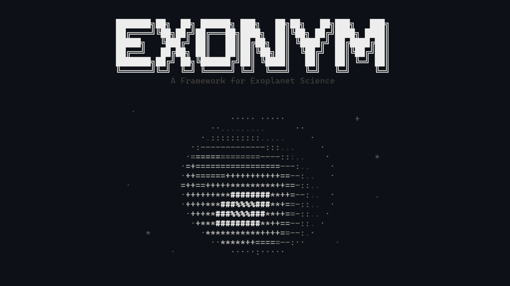

<div align="center">
  
  <br><br>
  <p>
    <a href="https://www.python.org/downloads/"></a>
    
    <a href="LICENSE"></a>
    
  </p>
</div>

EXONYM is an open-source Python framework for the detection, physical modeling, multi-sector astrophysical characterization, and statistical false-positive vetting of exoplanet transit candidates from TESS, Kepler, and K2 time-series photometry.

<div align="center">
  
</div>

## Scientific Capabilities

- **Photometry & Detrending:** Automated ingestion of TESS SPOC (2-minute and 20-second cadence) light curves and target-pixel files (TPFs) from MAST. Outlier rejection, running-median filtering, and Gaussian Process detrending via Wotan and Celerite.
- **Transit Detection:** High-resolution Box Least Squares (BLS) and native-cadence Transit Least Squares (TLS) search with harmonic validation, duration grids, and odd-even transit consistency tests.
- **MCMC Transit Modeling:** Physical transit light-curve modeling (Mandel & Agol 2002) with free quadratic limb darkening (Kipping 2013 parametrization), affine-invariant MCMC sampling (emcee), and dynamic nested sampling (dynesty). Supports atomic checkpoints and resumption (`--resume`).
- **Astrophysical Diagnostics:** Transit Timing Variations (TTV) with formal orbital decay fitting ($dP/dt$), phase-curve reflection/beaming/ellipsoidal harmonics, broadband SED fitting with MIST isochrones, and multi-instrument Keplerian radial velocity modeling.
- **Statistical False-Positive Vetting:** Automated TRICERATOPS and native vectorized TREX probabilistic vetting engines calculating False Positive Probability (FPP) and Nearby False Positive Probability (NFPP) with immutable SHA-256 cryptographic provenance.
- **Context & Localization:** Federated Gaia DR3 neighborhood queries, contrast-curve interpolation, and sub-pixel difference-image PRF localization.

## Platform & Hardware Support

- **Operating Systems:** Linux (Ubuntu, Debian, RHEL, Arch; HPC/cluster ready), macOS (Apple Silicon arm64 & Intel x86_64), and Windows (10 / 11 64-bit with native PowerShell support).
- **GPU Acceleration:** Optional GPU-accelerated Hamiltonian Monte Carlo (NUTS) transit inference via JAX / NumPyro (`--sampler numpyro --device gpu`).
- **CPU Multiprocessing:** Multi-core parallel sampling via `emcee` with automatic thread oversubscription prevention (`OMP_NUM_THREADS="1"` and `--n-jobs <N>`).
- **Air-Gapped Local Operation:** Ingestion connects to NASA MAST and Gaia; all subsequent search, fitting, TTV, and vetting pipelines execute 100% locally from cached data and SHA-256 sidecars.

## Installation

```bash
# Clone the repository
git clone https://github.com/shenfurkan/EXONYM.git
cd EXONYM

# Base framework installation
pip install -e .
```

### Optional Scientific Engine Tiers

| Extra | Key Dependencies | Enabled Capabilities |
| :--- | :--- | :--- |
| `discovery` | `transitleastsquares` | High-cadence Transit Least Squares (TLS) search |
| `screening` | `triceratops` | TRICERATOPS statistical false-positive calculation |
| `inference` | `dynesty` | Dynamic nested sampling for Bayesian evidence |
| `detrending` | `wotan` | Advanced GP and spline light-curve detrending |
| `asteroseismology` | `pysyd`, `tess-atl` | Stellar oscillation frequencies ($\nu_{\max}$, $\Delta\nu$) |

To install all optional modules at once:
```bash
pip install -e ".[discovery,screening,inference,detrending,asteroseismology]"
```

## Verification & Self-Testing

Verify that your local environment, compilers, and mathematical engines are functioning correctly:

```bash
# Run scientific unit test suite
pytest tests/test_trex.py -q

# Audit source-tree target neutrality
exonym verify --source
```

## Quickstart

```bash
# 1. Initialize an isolated candidate workspace
exonym init my-candidate --tic <TIC_ID> --mission tess

# 2. Ingest multi-sector SPOC light curves
exonym ingest my-candidate --sectors <SECTOR_NUM>

# 3. Detect periodic transit signal (BLS or TLS)
exonym search my-candidate --engine bls

# 4. Run MCMC transit model and generate diagnostic figures
exonym fit my-candidate --n-jobs 4
exonym plot my-candidate --corner

# 5. Compute statistical false-positive probability
exonym vet my-candidate

# 6. Export publication-ready LaTeX macros and figures
exonym export-paper my-candidate
```

## Workspace Output Structure

Each candidate workspace encapsulates all data, models, and diagnostic outputs in an isolated directory:

```text
candidate/<candidate-id>/
├── data/raw/       # Ingested FITS products & cryptographic provenance sidecars
├── outputs/        # Periodograms, MCMC posteriors, FPP vetting JSON
├── figures/        # Phase-folded light curves and MCMC corner plots
└── paper/          # Exported LaTeX macros and publication artifacts
```

## Core CLI Command Reference

| Command | Primary Function |
| :--- | :--- |
| `exonym init <id> --tic <tic>` | Provision isolated candidate workspace |
| `exonym ingest <id> --sectors <sec>` | Download SPOC light curves and target-pixel files |
| `exonym detrend <id> --method <m>` | Running-median, Wotan GP, or Celerite detrending |
| `exonym search <id> --engine {bls,tls}` | Blind period search and harmonic validation |
| `exonym screen <id>` | Fixed-ephemeris odd-even and secondary eclipse check |
| `exonym fit <id> [--sampler {emcee,dynesty,numpyro}]` | Mandel-Agol MCMC parameter inference (CPU/GPU) |
| `exonym plot <id> [--corner]` | Render phase-folded transit and MCMC posterior plots |
| `exonym ttv <id> [--fit-orbital-decay]` | Transit timing variation and orbital decay analysis |
| `exonym phasecurve <id>` | Atmospheric reflection, beaming, and ellipsoidal harmonics |
| `exonym rv fit <id>` | Multi-instrument Keplerian radial velocity fit |
| `exonym vet <id>` | TRICERATOPS statistical false-positive vetting (FPP/NFPP) |
| `exonym export-paper <id>` | Generate candidate-local LaTeX macros and paper figures |
| `exonym freeze <id> --version <v>` | Package an immutable, hash-bound reproducibility release bundle |

## Issues & Bug Reporting

If you encounter bugs, numerical anomalies, or have feature requests for new astrophysical models, please submit an issue via the [GitHub Issue Tracker](https://github.com/shenfurkan/EXONYM/issues).

## License

This project is licensed under the [GNU General Public License v3.0](LICENSE).
