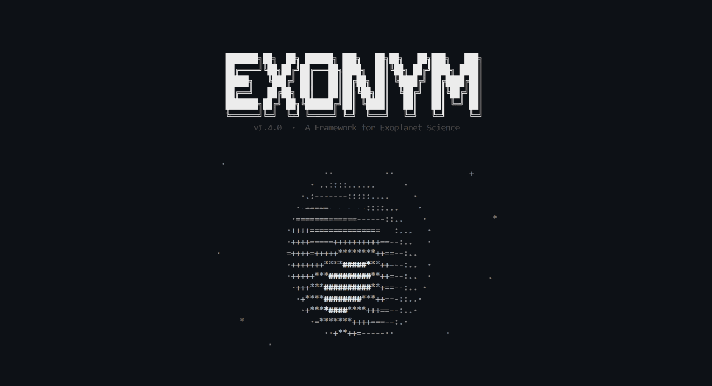

<div align="center">
  
  <br><br>
  <p>
    <a href="https://www.python.org/downloads/"></a>
    
    <a href="LICENSE"></a>
  </p>
</div>

EXONYM is a Python 3.9 command-line tool for working through TESS transit signals one candidate at a time. It creates an isolated workspace, downloads SPOC light curves and target-pixel files, and keeps the evidence, decisions, and outputs together. Shared code never contains a target identifier, sector choice, ephemeris, or research payload.

## Scope and scientific status

EXONYM runs each candidate through one ordered pipeline: SPOC ingestion with provenance sidecars, BLS or TLS detection, fixed-ephemeris photometric screening, Gaia and catalog context, pixel localization, stellar characterization (SED, asteroseismology, activity, dilution), native-cadence transit fitting, TTV and phase-curve timing, and a TRICERATOPS-based diagnostic false-positive probability. Every step writes schema-checked, hash-bound artifacts into the candidate workspace, so each result stays inspectable and reproducible.

A statistical validation claim additionally needs inputs beyond the current package: a calibrated mission-PRF scene model (claim generation stays disabled until that integration exists) and, depending on the target, follow-up resources such as precision radial velocities, high-resolution imaging, or independent photometry. EXONYM organizes the diagnostic evidence those programs consume.

EXONYM keeps two things separate:

- The shared code implements generic procedures such as transit searches, fixed-ephemeris screening, catalog context, and posterior sampling.
- Each candidate workspace contains the identity, inputs, provenance, diagnostic products, decisions, claims, and release records for one target.

That separation keeps each result inspectable without turning the shared package into a store of target facts. You can see which inputs, method, and decision led to a conclusion.

You can label a workspace with several missions, but data ingestion and most commands are TESS-focused. Treat the repository thresholds as screening rules, not universal boundaries between planets and false positives.

### Independent discovery policy

Independent discovery starts with a TIC target that has no assigned TOI or cTOI. Record the ExoFOP and literature checks in the intake workspace. A known TOI is still useful for method checks, comparisons, or follow-up, but it is not an independent EXONYM discovery unless the workspace documents a separate contribution.

### Read this before interpreting an output

- Scientific commands require candidate-owned observations and fail when their required inputs are absent. Synthetic fixtures are limited to tests and never create candidate evidence.
- `exonym screen` requires real photometry and a real ephemeris. The same evidence rule applies to search, fitting, phase-curve, activity, asteroseismic, dilution, and TTV commands.
- `exonym rv fit` is a descriptive fixed-period comparison. It jointly fits per-instrument offsets and jitter, a linear trend, and an activity term only when every RV datum carries the same-unit activity index; it does not confirm a companion or model correlated stellar noise.
- Workflow gates verify the existence, structure, and checklist state of evidence artifacts. They do not independently reproduce the scientific judgement written in a checklist or claim.
- Diagnostic plots are derived from candidate artifacts. They do not establish a TPF-derived centroid measurement, so use calibrated difference-image or pixel-level analysis for centroid evidence.

## Design principles

| Principle | What EXONYM enforces |
| --- | --- |
| Target isolation | All target-specific material lives below `candidate/<candidate-id>/`. Shared source, tests, templates, schemas, and documentation stay target-neutral. |
| Evidence traceability | Inputs, derived artifacts, decisions, phase-gate records, and lifecycle events are stored in the candidate workspace. |
| Schema-bound records | Candidate metadata, provenance sidecars, and scientific claims are checked against JSON Schema 2020-12 definitions. |
| Sequential review | A seven-phase workflow prevents a candidate from skipping intake, feasibility, acquisition, vetting, follow-up, analysis, or final review. |
| Reproducibility release | Release bundles carry a full candidate evidence snapshot, frozen source, an exact-version dependency closure, a content manifest, and a detached manifest digest. Their offline replay check does not re-run scientific engines or remote services. |

### Why the name EXONYM?

According to the [United Nations](https://unstats.un.org/unsd/publication/seriesm/seriesm_88e.pdf), an **exonym** is an externally assigned name used by an outer community to refer to an entity outside its jurisdiction, adapted without altering the original local *endonym*.

In this framework, **EXONYM** serves as an architectural metaphor: the shared codebase acts as a target-neutral outer observer that interacts with candidates solely through external identifiers and standardized placeholders, while the true candidate identity, raw inputs, and research payloads remain strictly isolated within `candidate/<candidate-id>/`.

## Installation

EXONYM requires Python 3.9 or later and runs on Linux, macOS, and Windows. Create and activate a virtual environment with your preferred tooling, then install from the repository root:

```
pip install .
```

Optional analysis engines install separately when a workflow needs them:

```
# Transit Least Squares search engine
pip install ".[discovery]"

# TRICERATOPS vetting backend
pip install ".[screening]"

# Asteroseismology tools
pip install ".[asteroseismology]"

# dynesty sampler for exonym fit --sampler dynesty
pip install ".[inference]"

# wotan detrending methods for exonym detrend --method wotan
pip install ".[detrending]"
```

Confirm the installed command:

```
exonym --version
exonym --help
```

Networked operations need access to their upstream services. In particular, SPOC ingestion needs a catalog identifier and network access, Gaia and ExoFOP queries depend on remote services, and TRICERATOPS and TLS require their optional dependency groups.

## First discovery run

The placeholders below are deliberately generic; do not place real catalog identifiers or target aliases in shared documentation, source code, or tests.

```
# Create a workspace for an independent-discovery target.
exonym init <candidate-id> --tic <tic> --mission tess

# Inspect the workspace created by init and confirm repository isolation.
exonym status <candidate-id>
exonym verify --source

# Download SPOC light curves and target pixel files for selected sectors.
exonym ingest <candidate-id> --products both --sectors <sector>

# Search the acquired real photometry with the default BLS engine.
exonym search <candidate-id> --engine bls

# If the discovery extra is installed, also run native-cadence TLS.
exonym search <candidate-id> --engine tls

# Inspect outstanding evidence requirements before advancing a phase.
exonym track <candidate-id>
exonym advance <candidate-id>
```

`exonym advance` checks whether the required records and checklist items are present, not whether the science is sound. Check a box only after the candidate evidence supports it, and write caveats in the relevant candidate document.

### Blind-discovery surveys

`exonym survey` records a bounded TESS cohort below
`candidate/_surveys/<survey-id>/`. Each registered target keeps an explicit
survey outcome, including novelty-audit blocks and searches without alerts.
Survey search uses only the manifest's frozen sectors and a preregistered SNR
threshold. For each target it runs the following controls before routing any
alert to human review: a BLS search across a one-, two-, and four-hour
duration grid comparing both normalized and per-sector running-median flux;
an inverted-flux null search; three deterministic scrambled-flux searches with
fixed seeds; and finite-exposure box-model transit injection at three phase
offsets to check period and epoch recovery at the survey SNR threshold. The
cadence integration is inferred from the candidate time grid and does not make
the injection a limb-darkened physical transit model. The running-median
branch splits large intra-sector cadence gaps before filtering. An alert requires
the reference BLS, the normalized search, and the duration-grid search to all
clear the threshold, both diagnostic periods to agree with the reference within
one percent, every null-control SNR to stay below the threshold, and at least
two of three injections to recover. These controls provide neither a population
false-alarm calibration nor a completeness map, source localization, or
statistical validation; localization, fitting, follow-up, archive checks, and a
final FPP run remain required before an independent-detection claim.

Each fresh survey robustness artifact also preserves a fixed-ephemeris
odd-even comparison, half-phase window, and doubled-period alternating-event
diagnostic for the selected BLS ephemeris. An unresolved window neither clears
nor establishes an alias; eclipsing-binary versus planet dispositions belong to
human review.

Separately, `exonym survey sensitivity` runs a candidate-local grid of three
periods, three durations, three depths, and four evenly spaced phase offsets
through both preprocessing branches. Each grid cell reports its recovery
fraction with a Wilson 95% interval so the limited phase-trial uncertainty is
visible. It remains a fixed box-model diagnostic for one target, separate from
any population selection function, detection-reliability calibration, or
completeness estimate.

Pass `--toi <toi>` only when a known TOI is deliberately being analyzed for validation, comparison, or follow-up rather than independent discovery.

## Candidate lifecycle and gate logic

Candidate disposition follows one ordered state machine:

```text
intake -> feasibility -> acquisition -> vetting -> followup -> analysis -> review
```

The active phase advances only when its gate passes. `stopped` workspaces cannot advance. For Markdown-gated phases, the parser looks for the required document and checked mandatory items. It checks the checklist structure, not the scientific judgement behind the text.

| Phase | Candidate-local evidence | Gate behavior |
| --- | --- | --- |
| `intake` | `docs/01_intake_manifest.md` records catalog identity, astrometry, stellar context, collision checks, catalog review, and literature screening. | Every mandatory checklist item must be checked. |
| `feasibility` | `docs/02_feasibility_report.md` records contamination, expected signal-to-noise ratio, observing coverage, stellar parameters, and novelty assessment. | The checklist must pass and `decisions/novelty_audit.json` must be current, schema-valid, candidate-matched, and marked eligible. |
| `acquisition` | Raw FITS products and provenance sidecars under `data/raw/`. | At least one `.fits` or `.fz` file must exist, and every such file needs a matching `<stem>.provenance.json` sidecar. |
| `vetting` | `docs/03_spoc_dv_vetting.md` records odd-even, difference-image centroid, ephemeris-match, and secondary-eclipse assessments. | Every mandatory checklist item must be checked. The gate does not recompute these diagnostics. |
| `followup` | `docs/04_tfop_sg_followup.md` records photometry, reconnaissance spectroscopy, high-resolution imaging, and precision-RV status. | Every mandatory checklist item must be checked. |
| `analysis` | Structured scientific claims in `claims/`. | FPP claims are currently disabled: the gate always blocks advancement until provenance-bound observed photometry and calibrated scene constraints are integrated into the statistical validation workflow. |
| `review` | `decisions/review_gate.md`, a current novelty audit, and the complete candidate record. | The checklist and novelty audit must pass. Successful review sets the lifecycle state to `published` and writes a final gate record. Leaving `published` later requires an explicit reason through `set-state`. |

The novelty-audit record must have a valid schema, match the workspace candidate, declare `status: "eligible"`, and contain a nonexpired, timezone-aware evidence trail. This prevents a stale or mismatched literature check from satisfying feasibility or review.

Use lifecycle changes rather than direct JSON edits:

```
exonym set-state <candidate-id> --state paused --reason "Awaiting follow-up observations"
```

Valid lifecycle states are `active`, `paused`, `stopped`, `published`, and `archived`. Lifecycle events are appended to `lifecycle/events.jsonl` within the candidate workspace.

## Isolation and data stewardship

The central invariant is strict: no target-specific data, identifiers, aliases, or constants may exist outside `candidate/`. `exonym verify` audits the shared working tree through four layers:

| Audit layer | Check |
| --- | --- |
| Repository layout | Rejects forbidden top-level `data/` and `archive/` directories. |
| Research payloads | Rejects scientific payload extensions outside `candidate/`, including FITS, CSV, image, notebook, and array files. |
| Catalog identifiers | Detects TOI, TIC, and related catalog-ID strings in target-neutral text. |
| Shared-source constants | Parses `src/` with the Python AST and rejects numeric literals assigned to sector or ephemeris-like variable names. |

Run the audit whenever a change could affect the boundary:

```
exonym verify --source
exonym verify --source --schemas-only
exonym verify --candidates
exonym verify --candidates --schemas-only
```

`exonym verify --source` does not read `candidate/`, so it completes quickly during source changes. `exonym verify --candidates` performs the full workspace audit, including registered-alias checks and candidate-record schema validation. It reuses candidate-local hash and metadata cache entries only when file size and mtime match; use `--fresh` for a full rehash. `--fix` or `--remediate` can refresh semantically unchanged derived hashes and synchronize an existing triage record. A policy exception, when genuinely needed, belongs in `policy/isolation-exceptions.json` and must identify the exact path, line, rule, reason, and an expiry date.

## Workspace anatomy

`exonym init` creates the core candidate-local workspace shown below. `data/processed/` is an optional input location that loaders inspect before raw products. The candidate identifier appears only in this subtree.

```text
candidate/<candidate-id>/
  candidate.json              Candidate metadata, lifecycle, and workflow state
  config/signals/             Catalog priors and declared transit-signal inputs
  data/raw/                   Downloaded FITS products and provenance sidecars
  data/processed/             Optional processed light-curve inputs
  docs/                       Intake, feasibility, vetting, and follow-up records
  decisions/                  Novelty audit and review decisions
  outputs/                    Machine-readable screening and analysis artifacts
  figures/                    Candidate-local diagnostic figures
  claims/                     Structured scientific assertions
  gates/                      Immutable phase-gate validation records
  lifecycle/                  Append-only state-transition events
  releases/                   Reproducibility-bundle directories

src/exonym/                   Target-neutral library and CLI implementation
schemas/                      JSON Schema 2020-12 definitions
templates/                    Files cloned into candidate workspaces created by init
policy/                       Isolation policy and approved exceptions
tests/                        Target-neutral automated test suite
```

## Command reference

All commands accept the global form `exonym [--root <repository-root>] <command>`. Run `exonym <command> --help` for argparse help and the full option list.

### Workspace, lifecycle, and audit commands

| Command | Key options | Result |
| --- | --- | --- |
| `init <candidate-id>` | `--toi`, `--tic`, `--mission {tess,kepler,k2,plato,cheops}`, repeatable `--tag` | Provisions a workspace, clones templates, validates metadata, and prints candidate JSON. The identifier alone is accepted, although catalog identity is needed by some downstream operations. |
| `list` | `--phase`, `--tag`, `--mission` | Prints metadata records matching the filters. |
| `status <candidate-id>` | None | Prints candidate metadata and candidate-relative workspace paths. |
| `tag <candidate-id> <tag> [<tag> ...]` | Positional tags | Adds tags and prints the resulting tag list. |
| `track <candidate-id>` | None | Renders an ANSI/ASCII progress dashboard from candidate-local checklists. |
| `advance <candidate-id>` | None | Validates the current gate, writes a gate record and lifecycle event, then promotes the workflow when allowed. |
| `set-state <candidate-id>` | Required `--state`; optional `--reason` | Performs an audit-logged lifecycle transition. A reason is required when leaving `stopped`, `published`, or `archived`. |
| `freeze <candidate-id>` | `--version` | Creates a candidate-local reproducibility bundle and prints its path. |
| `survey init <survey-id>` | `--mission tess --sectors <int> [<int> ...] --review-snr <float>` | Creates a bounded survey and freezes its internal BLS triage threshold below `candidate/_surveys/`. |
| `survey add-target <survey-id> <candidate-id>` | None | Adds one TOI-free TESS workspace to the cohort denominator. |
| `survey search <survey-id> <candidate-id>` | None | Runs BLS only on the survey sectors using its frozen threshold after a current eligible novelty audit; it records a triage outcome, not a planet claim. |
| `survey sensitivity <survey-id> <candidate-id>` | None | Runs a fixed candidate-level period-duration-depth injection grid in both preprocessing branches and reports recovery intervals without changing survey routing. |
| `survey exclude <survey-id> <candidate-id>` | `--reason <text>` | Retains a documented pre-search exclusion without changing the candidate lifecycle. |
| `survey report <survey-id>` | None | Prints every registered target and its recorded outcome. |
| `verify --source` | `--schemas-only` | Audits shared files and validates shared schema definitions without traversing `candidate/`. |
| `verify --candidates` | `--schemas-only`, `--fresh`, `--fix` | Runs the cache-aware candidate integrity audit. `--fresh` rehashes, and `--fix` repairs safe derived drift. |
| `export-paper <candidate-id>` | `--signal` | Writes candidate-local TeX macros and a hash-bound manuscript export manifest without making a claim. |

### Acquisition, search, and screening commands

| Command | Key options | Primary artifact or result |
| --- | --- | --- |
| `ingest <candidate-id>` | `--sectors <int> [<int> ...]`, `--exptime <int>`, `--products {lc,tp,both}` | Downloads SPOC light curves and/or target pixel files into `data/raw/` and writes provenance sidecars. `lc` is the default product choice. |
| `fetch-priors <candidate-id>` | None | Retrieves available catalog transit priors into `config/signals/transit_config.NN.json`. It can legitimately return an empty list. |
| `catalog record-ephemeris <candidate-id>` | Source kind, HTTPS URI, raw artifact, BJD_TDB period/epoch/duration, retrieval and expiry times | Adds reviewed EB, variable-star, ExoFOP, or literature ephemeris evidence only when its raw local source artifact can be hash-bound. |
| `catalog match-ephemeris <candidate-id>` | `--signal` | Writes a hash-bound comparison with fresh NEA planetary-system and TOI rows plus supported recorded evidence. A match requires human review; no match is not a novelty decision. |
| `detrend <candidate-id>` | `--method`, `--window-days` | Writes a hash-bound processed array with detrended flux, propagated errors, sector labels, and raw-input provenance. |
| `search <candidate-id>` | `--engine {bls,tls}`, `--period-min`, `--period-max`, `--signal`, `--detrending-method` | Writes engine-specific search results and a content-addressed input manifest. The default blind period interval is 0.5 to 15.0 days. TLS requires the `discovery` extra. |
| `screen <candidate-id>` | `--signal`, `--detrending-method` | Writes `outputs/fixed_ephemeris_screen.json` or a signal-scoped equivalent after fixed-ephemeris primary, odd-even, half-phase, and alternating-event checks. |
| `vet <candidate-id>` | `--n-draws`, `--signal` | Runs the optional TRICERATOPS wrapper and writes `outputs/triceratops_report.json` with input provenance and a claim-ineligible diagnostic FPP. The default draw count is 2000. |
| `archive <candidate-id>` | `--radius-arcsec` | Writes `outputs/archival_vetting_report.json` from Gaia DR3 and available ExoFOP context. The default search radius is 60 arcsec. |
| `plot <candidate-id>` | `--signal` | Writes a candidate-data phase-folded light-curve figure, plus an optional posterior corner plot when a matching fit chain exists. It does not create a centroid-evidence figure. |

### Exploratory characterization commands

| Command | Key options | Primary artifact or result |
| --- | --- | --- |
| `asteroseismology <candidate-id>` | `--numax-min`, `--numax-max` | Writes `outputs/asteroseismic_results.json`. |
| `localization <candidate-id>` | `--search-radius` | Writes `outputs/prf_localization_results.json` from pixel-depth and Gaussian-template screening. |
| `sed <candidate-id>` | None | Writes `outputs/sed_fit_results.json` and an MCMC chain array. |
| `fit <candidate-id>` | `--n-samples`, `--eccentric`, `--signal`, `--detrending-method` | Writes `outputs/mcmc_transit_fit.json` and an MCMC chain array. The default chain length is 5000 samples. |
| `phasecurve <candidate-id>` | None | Writes `outputs/phase_curve_results.json`. |
| `ttv <candidate-id>` | `--signal` | Writes `outputs/ttv_analysis_results.json` and may create a timing diagram. |
| `activity <candidate-id>` | None | Writes `outputs/stellar_activity_results.json`. |
| `dilution <candidate-id>` | None | Writes `outputs/dilution_sensitivity_results.json` using supplied or previously archived neighbor information. |

## Scientific methods and interpretation

The following descriptions document the implemented procedures, not an abstract ideal pipeline. Each method should be interpreted together with its input provenance, diagnostic flags, and limitations.

### Transit search

`exonym search --engine bls` uses Astropy's weighted Box Least Squares implementation. It fits a box-shaped periodic transit model using normalized per-cadence flux uncertainties when they are usable; otherwise it records a robust-scatter fallback in the result and manifest. The reported `snr` is the fitted transit depth divided by its formal BLS depth uncertainty.

Candidate light-curve and TPF photometry are accepted only when their TESS sector is present in product metadata or a canonical filename. Loaders skip unscoped products instead of inventing a sector label, so sector-specific baselines, survey scopes, and pixel-localization summaries cannot silently use guessed metadata.

The search grid is set from the observed time baseline and trial duration, so the `n_periods` setting requests at least that density but cannot make the grid coarser than the baseline-duration resolution criterion. A retained peak must contain at least two observed transit-event windows. The blind command uses a fixed three-hour duration unless a survey supplies its declared duration grid; `best_duration_hours` therefore describes the selected box-model duration, not a recovered physical transit duration.

The fitted-depth SNR is a ranking statistic for human review; it carries no look-elsewhere correction, population detection-reliability calibration, or correlated-noise model. Inspect aliases, phase-folded photometry, alternate detrending, null controls, and injection recovery before treating a peak as an astrophysical event.

`exonym search --engine tls` uses the optional Transit Least Squares engine on native-cadence photometry and per-cadence flux uncertainties. It reports TLS Signal Detection Efficiency alongside period, epoch, depth, and duration. TLS improves transit-shape matching but does not calibrate its own false-alarm rate; injection-recovery and null searches remain required before ranking alerts as a survey result.

### Fixed-ephemeris photometric screening

`exonym screen` measures a primary window, odd and even event depths, a half-phase window for secondary-eclipse evidence, and doubled-period alternating-event behavior. It reports the odd-even consistency statistic:

```text
Z_odd-even = abs(d_odd - d_even) / sqrt(sigma_odd^2 + sigma_even^2)
```

The nominal helper criterion is `Z_odd-even < 3`. Its uncertainty calculation uses median-depth approximations and does not model red noise, detrending choices, crowding, dilution uncertainty, or ephemeris uncertainty; within those assumptions, a value below the threshold indicates no resolved odd-even depth difference.

The centroid helper computes angular displacement significance as:

```text
Z_centroid = sqrt((delta_RA * cos(dec))^2 + delta_Dec^2) / sigma
```

`Z_centroid < 3` is likewise a screening convention, not a substitute for validated difference-image centroid analysis. The shared vetting utilities also include an ellipsoidal-amplitude estimate based on mass ratio, stellar radius, orbital separation, and inclination. Treat it as a plausibility diagnostic, especially for short-period stellar companions, rather than a complete binary model.

### False-positive probability and archival context

`exonym vet` uses the optional [TRICERATOPS](https://github.com/stevengiacalone/triceratops) package for false-positive scenarios. It is guarded by the required candidate-local screening, archive, localization, activity, and dilution artifacts, then passes prepared observed photometry, per-cadence uncertainties, exposure time, sectors, and the declared ephemeris to the Monte Carlo backend. The report records the random seed, package versions, inputs, and any backend failure.

The current localization and scene treatment are uncalibrated, so completed Monte Carlo reports are stored as documented diagnostics outside the claim workflow. A calibrated mission PRF/scene model, validated contrast and contamination constraints, reproducibility across independent draws, and human review are required before any validation decision.

> [!IMPORTANT]
> TRICERATOPS can keep a machine busy for a long time and may use significant CPU or memory. Dedicated or remote execution is suitable for a long exploratory run when data policy permits. Keep a candidate-local record of the command, package version, input hashes, and output, then rerun any result that supports a claim in the project's frozen environment.

`exonym archive` queries Gaia DR3 through available TAP, VizieR, and mirror backends. It validates target association within two arcsec, including proper-motion propagation where applicable. A Renormalised Unit Weight Error value above 1.4 flags possible unresolved multiplicity, but does not establish binarity. The command's default ten-arcsec archive radius is suitable for local catalog context, not a complete crowding analysis when brighter contaminants sit farther from the target aperture.

`exonym catalog match-ephemeris` compares the candidate ephemeris with fresh, retained NASA Exoplanet Archive `pscomppars` and TOI rows, and with fresh candidate-recorded known-signal evidence. The `pscomppars` parser compares an epoch only when its source row declares BJD_TDB. The TOI parser compares period and duration but retains its epoch as unavailable for comparison because the retrieved BJD label does not establish BJD_TDB. Use `exonym catalog record-ephemeris` only after reviewing an EB, variable-star, ExoFOP, or literature source: the command accepts a BJD_TDB period, epoch, and duration only when a local raw source artifact, HTTPS source URI, retrieval time, and expiry time are recorded and hash-bound. A period/epoch agreement, or a period harmonic without a comparable epoch, is a review requirement; a no-match result is limited to the retained current evidence and never establishes novelty.

### Pixel localization and dilution

`exonym localization` constructs a pixel depth map:

```text
D = (F_out - F_in) / F_out
```

It fits nonnegative amplitudes of isotropic Gaussian source templates using nonnegative least squares. This procedure is a depth-centroid and source-competition screen, not a calibrated fit to a mission PRF library; treat source dominance as provisional while competing sources remain unmodeled.

`exonym dilution` reports a contamination ratio:

```text
C_contam = sum(F_neighbor / F_target)
```

When only Gaia magnitudes are available, it uses the approximate flux ratio `10^(-0.4 * (G_neighbor - G_target))`. It compares pipeline and square-aperture assumptions. Gaia G-band contrast is not TESS-band contrast, and a catalog neighbor is not a model of its eclipse depth, so the result bounds plausible dilution rather than resolving every blend scenario. The dilution command consumes supplied neighbor data or a validated archival report; it does not query Gaia itself.

### Transit fitting and stellar parameters

`exonym fit` uses Batman transit models with MCMC sampling. Quadratic limb-darkening parameters are sampled through Kipping-style transformed variables:

```text
u1 = 2 * sqrt(q1) * q2
u2 = sqrt(q1) * (1 - 2 * q2)
```

When a stellar-density constraint is available, the model uses:

```text
a_over_Rstar = (G * P^2 * rho_star / (3 * pi))^(1/3)
```

The current fitter evaluates native-cadence transit-window data with sector-specific exposure integration, independent white errors, and a jitter term. It does not fit a Gaussian-process noise model or provide an adopted posterior. Inspect posterior correlations, prior sensitivity, dilution treatment, and cadence integration before converting a fitted radius ratio into a physical companion radius.

`exonym sed` fits a reddened blackbody representation at catalog pivot wavelengths with `emcee`. It uses parallax information to infer radius and luminosity. It gives a transparent first-pass stellar context, not a passband-integrated atmosphere analysis.

`exonym asteroseismology` estimates a power spectral density, whitens a median background, searches for a smoothed oscillation envelope, and estimates the large frequency separation from lag correlation. It applies standard solar-like scaling relations, including:

```text
R_star / R_sun = (numax / numax_sun) * (Dnu / Dnu_sun)^(-2) * (Teff / Teff_sun)^(1/2)
M_star / M_sun = (numax / numax_sun)^3 * (Dnu / Dnu_sun)^(-4) * (Teff / Teff_sun)^(3/2)
```

The output includes physical sanity checks. Scaling relations are empirical approximations with regime-dependent systematics.

### Variability, phase curves, and timing

`exonym phasecurve` regresses sector offsets and slopes with reflection, Doppler-beaming, ellipsoidal, harmonic-control, and phase-0.5 eclipse terms. It uses block-clustered covariance over half-day blocks. A component at or above three standard deviations prompts systematics tests and an independent model comparison.

`exonym ttv` fits fixed transit templates to expected events and reports observed-minus-calculated timing in minutes:

```text
O_minus_C_minutes = 1440 * (t_observed - t_calculated)
```

For a proposed first-order resonance, it also reports the conventional super-period relation:

```text
1 / P_TTV = abs(j / P_outer - (j - 1) / P_inner)
```

Low signal-to-noise timing estimates can be dominated by shape and baseline noise. The module has no standalone timing-variation detection threshold.

`exonym activity` applies a per-sector generalized Lomb-Scargle search over one to twenty days, combines periods using power-weighted estimates, and fits a sinusoidal amplitude. It records the analytic white-noise FAP separately from a calibrated probability, the normalized sampling-window peaks, and cross-segment fundamental/half/double-harmonic consistency at each segment's frequency resolution. These are reviewer diagnostics: rotation or activity interpretations still require red-noise, window-function, harmonic, and persistence checks beyond the reported periodogram peak.

## Methodological limits

Use the framework to organize and test evidence.

- Transit-like signals can arise from eclipsing binaries, background blends, instrumental artifacts, stellar variability, or detrending behavior.
- BLS period aliases, sparse sampling, transit-duration assumptions, and time-correlated noise can bias detection statistics and ephemerides.
- Odd-even and centroid screening require appropriate photometry, aperture context, and uncertainty models. They do not replace image-domain vetting.
- Catalog queries can be incomplete, stale, or unavailable. A clean query result is not proof of isolation from contaminants.
- FPP estimates depend on the input light curve, stellar properties, contrast constraints, catalog completeness, and scenario priors. The current wrapper has the additional simplified-light-curve limitation described above.
- SED, seismic, phase-curve, activity, TTV, localization, and dilution outputs are exploratory unless their candidate-local inputs, uncertainty model, and validation checks support a stronger claim.

## Reproducibility releases

`exonym freeze <candidate-id> --version <version>` creates a release directory below `candidate/<candidate-id>/releases/`. It copies the candidate workspace (including raw inputs, derived outputs, claims, and candidate-local documents) except recursive prior releases and `scratch/`; it also copies the package source, schemas, templates, an exact-version dependency lock resolved in a dedicated environment, and Docker/Apptainer definitions. Regenerate the dependency lock whenever `pyproject.toml` changes.

`manifest.json` inventories every payload file by size and SHA-256. Its separate `manifest.sha256` file binds the manifest itself without a circular self-hash. Run `exonym verify-release <candidate-id> --version <version>` to validate both layers, validate the lock metadata, and launch a fresh Python interpreter that imports the frozen source and loads the frozen candidate workspace.

This offline replay check does not rerun scientific engines, network retrievals, or external services; record those execution conditions alongside a release when they matter for the result.

Continuous integration runs the automated test suite and the isolation audits on pushes and pull requests.

## License

EXONYM is licensed under the [GNU General Public License v3.0](LICENSE).
