# EXONYM scientific architecture and how to use it

EXONYM is a candidate-isolated evidence system for transit discovery, screening, exploratory characterization, and reproducible review. It is not an automatic confirmation or validation service. Shared source, documentation, schemas, and templates remain target-neutral; candidate identity, observations, configurations, plots, and decisions live only under `candidate/<candidate-id>/`.

## Scientific status

Every result must be interpreted with its retained inputs, assumptions, uncertainty representation, and declared limitation. BLS and TLS rank periodic transit-like signals. Screening, archival checks, localization, stellar characterization, transit fitting, and TRICERATOPS provide evidence with different failure modes. The current vetting path always writes `claim_eligible: false`, and the analysis gate remains blocked until calibrated scene constraints are integrated.

The authoritative source-module map is
[`scientific-method-contract.md`](scientific-method-contract.md). It records
the exact BTJD/BJD, normalized-flux/ppm, solar/CGS/SI, and angular-unit
contracts; the locally retained primary-source ADS bibcodes and DOIs; each
method's applicability boundary; and the reason no present diagnostic can
override `claim_eligible: false`.

## Pipeline map

```mermaid
flowchart LR
  A[Raw SPOC FITS and provenance] --> B[Quality and timing normalization]
  B --> C[BLS or TLS signal search]
  C --> D[Photometric screening]
  D --> E[Catalog and archival evidence]
  E --> F[TPF localization and dilution]
  F --> G[Stellar characterization]
  G --> H[Native-cadence transit inference]
  H --> I[Automated triage and diagnostic FPP]
  I --> J[Freeze, review, and paper drafting]
```



The workflow state machine is separate from this processing map:

```text
intake -> feasibility -> acquisition -> vetting -> followup -> analysis -> review
```

Advancing a workflow phase checks candidate-local evidence records and mandatory checklist items. It does not independently validate the scientific judgment behind a checked item.

## Phase 1: ingestion and provenance

`exonym ingest` fetches candidate-owned SPOC light curves and target-pixel files with bounded concurrent workers. It records a `<stem>.provenance.json` sidecar beside each raw FITS or FZ product. The acquisition gate requires each raw product to have a schema-valid sidecar with a matching SHA-256 digest; concurrency changes throughput, not the scientific contract.

The light-curve loader reads processed FITS before raw FITS when no explicit detrending artifact is selected. It removes nonfinite cadences, normalizes flux per product, and rejects nonzero quality cadences when a quality column is present. It does not treat a missing or malformed quality column as clean data. The resulting table records per-cadence normalized flux uncertainty, a verified sector label, input file paths, hashes, and `BTJD_TDB` as its time system.

SPOC time arrays are normalized to BTJD:

```text
BTJD = BJD_TDB - 2457000
```

The loader checks the FITS time scale, time unit, and declared reference before combining timestamps. It rejects incompatible time systems rather than silently mixing BJD, MJD, or UTC epochs.

### Detrending bridge

`exonym detrend <candidate-id> --method <method> --window-days <days>` writes a compressed candidate-local array and a derivation manifest. The artifact retains `time_btjd`, the detrended flux, propagated flux errors when available, and sector ownership. Its manifest binds the exact raw inputs and their SHA-256 digests. The bridge rejects products without sector labels or raw-input records.

Search, screen, and fit consume the product directly with the same option:

```powershell
exonym search <candidate-id> --engine bls --detrending-method running-median
exonym screen <candidate-id> --detrending-method running-median
exonym fit <candidate-id> --detrending-method running-median
```

No format conversion or copying into a FITS file is required. Search results record the selected detrending manifest and artifact hashes, and later validation rejects a result if either changes. The commands still require that the raw inputs remain provenance-valid. Detrending is a model choice that can attenuate or distort signals, so compare it with direct photometry and record the method and window in interpretation.

## Phase 2: signal detection

The BLS path uses Astropy's weighted Box Least Squares model. It searches a period grid whose frequency resolution is constrained by the observed baseline, with a characteristic lower bound of

```text
Delta f = 1 / T_obs
```

where `T_obs` is the usable time baseline. Trial durations are supplied as fractional transit windows. The output retains the best period, epoch, box duration, depth, formal depth uncertainty, event count, and SNR. The SNR is a fitted depth divided by the formal BLS depth error. It is a ranking statistic, not a look-elsewhere-corrected false-alarm probability.

The optional TLS engine operates on native cadence and uses per-cadence uncertainties. TLS has a more transit-like shape model than a box but does not calibrate a detection probability by itself. Both engines require null controls, alias inspection, and injection-recovery testing before a signal becomes a survey alert or a review priority.

Inspect common alternatives before interpreting a peak:

- Harmonics near `P / 2` and `2 P`
- Cadence and daily aliases near one day
- Alternate durations and out-of-transit baseline choices
- Distinct observed transit-event windows
- Inverted or scrambled-flux controls where the workflow defines them

## Phase 3: photometric consistency and screening

`exonym screen` evaluates the declared ephemeris against real candidate photometry. It measures primary depth, odd and even event depths, a half-phase control for a secondary eclipse, and a doubled-period alternating-event diagnostic.

The odd-even statistic is

```text
Z_odd-even = |d_odd - d_even| / sqrt(sigma_odd^2 + sigma_even^2)
```

where each depth uncertainty is a scatter-based estimate. A large value can identify an eclipsing-binary-like alternation, while a small value only means the available data did not resolve a difference under that uncertainty model. Red noise, dilution, detrending uncertainty, and ephemeris uncertainty are not a full posterior in this screen.

The half-period and double-period outputs are diagnostic comparisons, not automated binary classifications. Treat a secondary-depth measurement as a follow-up prompt until instrumental, thermal, and blend alternatives have been assessed.

## Phase 4: archival cross-match and federation

`exonym archive` and `exonym catalog` retain candidate-local catalog retrievals, normalized snapshots, parser logs, cross-match records, and raw response hashes. Gaia DR3 context provides source positions, proper motion, local neighbors, and available astrometric indicators. A renormalised unit weight error above the conventional `RUWE > 1.4` flag can suggest unresolved astrometric complexity, but it does not prove binarity.

Neighbor brightness is converted into a first-pass flux-ratio diagnostic using

```text
F_neighbor / F_target = 10^(-0.4 * Delta magnitude)
```

This is bandpass-dependent and cannot by itself predict the depth of a diluted eclipse. ExoFOP and known-signal comparisons are retained as dated evidence. A catalog no-match is limited to the captured providers and retrieval date; it is never a novelty decision.

## Phase 5: transit-source localization and pixel diagnostics

Target-pixel files support an image-domain screen. The basic difference image is

```text
Delta I = I_out_of_transit - I_in_transit
```

EXONYM evaluates depth maps and source competition with nonnegative least squares against local source templates. For a design matrix `A` and difference image vector `d`, the illustrative constrained solution is

```text
minimize || A x - d ||^2 subject to x >= 0
```

The result records source weights and a centroid-offset screen. A centroid comparison should report the offset vector and an uncertainty region, commonly described through a three-sigma confidence ellipse. The present template and PRF procedure is an uncalibrated source-competition diagnostic, not mission-calibrated centroid validation. Retain the TPFs, Gaia context, aperture choice, and all competing-source assumptions.

## Phase 6: stellar characterization

`exonym sed` accepts only a schema-valid, candidate-owned MIST v1.2 bolometric-correction manifest. The manifest binds Vega photometry, fixed `teff_k`, `logg_cgs`, and `[Fe/H]` from a stellar-parameters artifact, plus SHA-256-bound official `BC_tables/v1` archives. The runner uses multilinear interpolation on the native `Teff`, `logg`, `[Fe/H]`, and `A_V` grid with no extrapolation, profiles apparent bolometric magnitude, and minimizes chi square across the native `A_V` intervals.

The result records the fixed atmospheric inputs, fitted `A_V` in magnitudes, conditional apparent bolometric magnitude, and per-band residuals. It does not infer a stellar-atmosphere posterior, radius, luminosity, distance, parallax correction, evolutionary state, or validation constraint. Catalog covariance, blending, saturation, infrared excess, and MIST model uncertainty remain outside the reported diagonal-error chi square. Every SED result remains exploratory and `claim_eligible: false`.

The asteroseismic diagnostic estimates a power spectrum, a smoothed oscillation envelope, and a large frequency separation. The familiar solar-like scaling relations are

```text
Delta nu / Delta nu_sun proportional to sqrt(M / R^3)
nu_max / nu_max_sun proportional to g / sqrt(T_eff)
```

The native asteroseismic path records a Harvey-style granulation background, effective frequency bounds, Rayleigh resolution, and an optional evidence-backed Delta-nu correction. When finite frequency-resolution and effective-temperature uncertainties are present, EXONYM propagates them through a fixed-seed Monte Carlo summary and reports 16th, 50th, and 84th percentiles. These intervals exclude scaling-relation systematics and mode-identification uncertainty. Optional pySYD and tess-atl runs are retained as candidate-local adapter/status manifests and never substitute missing native values.

`exonym activity` uses a generalized Lomb-Scargle periodogram on transit-masked segments. It retains the analytic white-noise false-alarm reference, sampling-window peaks, and cross-segment harmonic checks. Rotation period uncertainty is summarized from the power-weighted segment peak distribution, and sinusoid amplitude includes a weighted linear-fit covariance propagation. Neither quantifies evolving active regions or correlated noise completely.

## Phase 7: physical transit fitting

`exonym fit` uses a Batman implementation of the Mandel and Agol transit model with sector-aware exposure integration. The likelihood operates on native-cadence points in the selected transit window, retaining one baseline per observed sector and a photometric jitter term.

Quadratic limb darkening is sampled in Kipping's triangular coordinates:

```text
u1 = 2 sqrt(q1) q2
u2 = sqrt(q1) (1 - 2 q2)
```

The default bounded `q1, q2` parameterization prevents arbitrary unphysical coefficient ranges. When a candidate-local LDTk prior has been generated from retained stellar-atmosphere inputs, `exonym fit --ldtk-prior` uses exactly one matching prior artifact. Do not substitute a catalog coefficient without the candidate-local input provenance.

The stellar density relation couples the transit geometry to the stellar prior:

```text
a / R_star = (G P^2 rho_star / (3 pi))^(1/3)
```

The density prior propagates candidate-supplied mass and radius errors under its recorded independent symmetric approximation. `--sampler auto` selects the 64-bit NumPyro/JAX path only when the requested device and compatible runtime are available; otherwise it records a CPU emcee fallback. Explicit runtime failures remain failures. Emcee and optional dynesty outputs report 16th, 50th, and 84th posterior percentiles, sampler configuration, exposure assumptions, fallback reason, and convergence diagnostics. CPU emcee can resume from its intermediate sampler checkpoint. This is still an exploratory native-cadence posterior: it lacks a calibrated correlated-noise model and independent-chain adoption criteria.

## Phase 8: statistical vetting and false-positive probability

The optional TRICERATOPS integration compares planetary and eclipsing scenarios such as a transit-like planet, eclipsing binary, background eclipsing binary, and hierarchical eclipsing binary. It records random seed, package version, observed-photometry provenance, scene artifacts, scenario outputs, FPP, and NFPP when the backend runs.

Automated triage aggregates screening, archive, localization, activity, dilution, and other pre-vetting records into a routing decision. Triage is not a scientific disposition. A `pass` only allows the final diagnostic vetting attempt when prerequisites exist.

The engine registry separates runtime availability from candidate-local execution
provenance. `engine run` writes input/output hashes and status manifests for
runnable diagnostics; missing dependencies and empty outputs remain explicit
blocked records. `survey auto-vet` and `survey run-loop` use the same bounded
candidate-data sequence, retain independent step failures, and never change
workflow state, disposition, or claim eligibility.

### Claim-eligibility calibration roadmap

`claim_eligible` must remain false until a calibrated scene-model interface is available. A future calibrated evidence adapter must provide the following candidate-local record before a claim could be considered:

```json
{
  "schema_version": 1,
  "candidate_id": "<candidate-id>",
  "calibration": {
    "model_id": "mission-prf-scene-model",
    "model_version": "<version>",
    "validation_dataset": "candidate-local or cited calibration release",
    "coverage": "bandpass, detector, cadence, and crowding regime",
    "calibration_status": "validated"
  },
  "constraints": {
    "contrast_curve_artifacts": [{"path": "...", "sha256": "..."}],
    "high_resolution_imaging_artifacts": [{"path": "...", "sha256": "..."}],
    "radial_velocity_artifacts": [{"path": "...", "sha256": "..."}],
    "scene_posterior_artifact": {"path": "...", "sha256": "..."}
  },
  "independent_review": {
    "status": "approved",
    "record_path": "..."
  }
}
```

The adapter must bind every cited file by hash, define likelihoods and priors, quantify calibration coverage, reject out-of-domain candidates, preserve posterior samples or sufficient statistics, and require independent review. High-precision RVs and high-resolution imaging are evidence inputs, not automatic confirmations. A future code change must add a schema, validator, tests for in-domain and out-of-domain cases, and an explicit claim policy before this field can become true.

## Phase 9: reproducibility and release

`exonym freeze <candidate-id> --version <version>` writes a candidate-local release bundle with source, templates, schemas, candidate workspace, dependency lock, manifest, and detached manifest digest. `exonym verify-release` checks the inventory and replays an offline import/load boundary. It does not rerun science engines, network requests, or remote catalog queries.

Operational recovery uses `exonym checkpoint save/list/restore/delete`. A
checkpoint is a compressed, hash-verified snapshot of mutable workspace state;
it excludes raw FITS, append-only provenance, and the checkpoint directory
itself. Restore verifies the archive before any byte changes, uses atomic
replacement, and appends an audit event. It cannot bypass a gate or rewrite
claim eligibility. This is separate from the intermediate emcee sample
checkpoint used by `fit --resume`.

Use scoped verification during development:

```powershell
exonym verify --source
exonym verify --candidates
exonym verify --candidates --fix
exonym verify --candidates --fresh
```

The candidate audit uses a candidate-local cache for unchanged metadata and content hashes, keyed by file mtime and size. Use `--fresh` before a high-assurance integrity review when filesystem metadata cannot be trusted. `--fix` only refreshes semantically unchanged detrending and search manifest digests. It never rewrites automated triage, raw products, candidate metadata, scientific values, or claim eligibility.

## Paper drafting

After the candidate outputs and figures are current, run:

```powershell
exonym export-paper <candidate-id>
```

The command writes `paper/generated/exonym_macros.tex` and `paper/generated/paper_export_manifest.json` under the candidate workspace. The macro file overrides only the template defaults and contains values available in the current candidate artifacts, with posterior formatting where those artifacts provide it. The template labels missing evidence as unavailable and retains `claim_eligible: false` in its guidance. The `.agents/skills/exoplanet-paper-writing/` skill defines the drafting, evidence mapping, and claim-language workflow.

## Scientific debugging and incident response

Scientific debugging begins with evidence integrity, not with a plot or a
plausible fitted value. Preserve the original candidate-local artifact and
reconstruct the causal path before rerunning an engine:

```text
raw product and provenance
  -> time/flux/error normalization
  -> derived product and manifest
  -> search or fixed-ephemeris evidence
  -> diagnostic model output
  -> triage/vetting decision
  -> interpretation limit and claim boundary
```

At every arrow, inspect ownership, SHA-256 lineage, schema validity, units, and
time system. In particular, do not phase fold mixed `BTJD_TDB`, `BJD_TDB`, MJD,
or UTC timestamps; do not compare fractional flux with ppm; and do not pass a
catalog coordinate, a stale derived artifact, or an estimated uncertainty where
the downstream command requires a retained candidate-owned input.

Classify a failure before attempting remediation:

| Class | Examples | Permitted conclusion |
|---|---|---|
| Software contract | Parser rejects strict JSON, a schema mismatch, a failed regression | The implementation needs repair; existing scientific output is not refreshed implicitly. |
| Environment | Missing optional package, incompatible dependency, TLS verification failure | Execution is unavailable or failed; it is not a scientific rejection. |
| Data/provenance | Hash mismatch, malformed FITS metadata, missing raw sidecar | The result is unbound and must not be interpreted. |
| Applicability | Invalid geometry, nonpositive uncertainty, insufficient observed cadence | The selected model is unsupported for this input. |
| Numerical | Nonfinite likelihood, unstable solver, inadequate sampler diagnostics | The numerical result is unresolved, not evidence for or against a planet. |
| Interpretation | FPP, localization, BLS/TLS ranking, or SED result exceeds its calibration | Retain it as diagnostic evidence with its limitation; do not make a claim. |

For a long-running command failure, retain the exact command, options, package
versions, seed, parallel mode, stdout/stderr, traceback, and exit code in the
candidate-local run record and the required `log/issue-YYYYMMDD-<slug>.md`
incident document. Runtime repair must be reproducible: record the package
versions before and after the repair, confirm the project dependency pins, and
re-run only the affected synthetic tests before a new candidate execution.

The debugger must stop at the earliest invalid boundary. It must not rerun a
vetting engine after decisive rejection evidence, alter lifecycle state to
unblock a gate, treat a review warning as a pass, or write a claim artifact.
`claim_eligible` remains false regardless of debugging progress.

## Practical review checklist

- Check time scale and flux normalization before combining inputs.
- Compare direct and detrended photometry where detrending affects interpretation.
- Review aliases, odd-even behavior, secondary controls, and null tests before following up a signal.
- Retain raw catalog responses, TPFs, scene assumptions, and input hashes with each result.
- Use posterior percentiles or named covariance assumptions, never an unlabeled point estimate.
- Keep the method limitation next to each scientific conclusion.
- Freeze the workspace and review the manuscript against the retained evidence before release.
