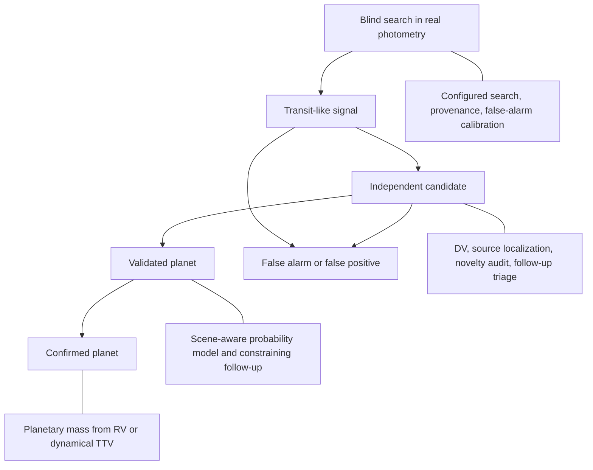

# Discovery readiness assessment

## Verdict

EXONYM is useful now as an independent TESS candidate-discovery, bounded-survey triage, and evidence-management framework. Its survey sensitivity and alert routing remain diagnostic; it is not a calibrated population survey or a statistical-validation system suitable for public planet-status claims.

The project is not thin. Its candidate isolation, provenance sidecars, structured records, lifecycle events, gate history, archive context, and exploratory diagnostics form a strong research-operating foundation. The scientific detection and validation layers need more work before the project can claim a new planet.

## What the project can claim today

- An independently recovered transit-like signal, when the search used real photometry and its provenance is recorded.
- A candidate under investigation after documented photometric, archival, and pixel-level screening.
- An auditable, traceable record of what was downloaded, calculated, and decided within a candidate workspace.

It should not call a signal a planet, statistically validated planet, or confirmed planet solely because it passes a workflow gate, has a low reported FPP, or lacks a TOI designation.

## Readiness summary

| Area | Current state | Release implication |
| --- | --- | --- |
| Candidate records and provenance | Strong | Ready for internal research use. |
| TOI-free discovery policy and novelty review | Operational harvest and matching | Requires current eligible audit plus human review; a no-match result alone is not novelty proof. |
| Blind transit search | Exploratory | Not calibrated as a survey detection statistic. |
| Instrumental and astrophysical vetting | Partial | Manual review and external evidence remain required. |
| Pixel source localization | Screening only | Cannot establish an on-target transit. |
| Statistical validation | Exploratory | Do not publish validation claims from the present FPP path. |
| Dynamical evidence | Descriptive RV and TTV diagnostics | Current fixed-period RV and optional orbital-decay/TTV diagnostics do not confirm a companion. |
| Integrity replay and recovery | Operational | Release replay is offline import/workspace loading; checkpoints are recovery snapshots, not scientific releases. |

## Recommended position

Describe EXONYM as an **independent TESS candidate-discovery, triage, and evidence-management system**. Its near-term output is an independently detected candidate with a documented disposition, not a validated or confirmed planet.

## Delivery order

| Order | Deliverable | Why it comes first |
| --- | --- | --- |
| 1 | Population-scale detection and completeness calibration | Candidate-level nulls and sensitivity exist, but cannot support survey reliability or completeness claims. |
| 2 | Calibrated scene localization and contrast/follow-up ingestion | Current localization, RV, and adapter records remain partial diagnostics. |
| 3 | Real-photometry, scene-aware FPP workflow | The existing TRICERATOPS path remains claim-ineligible. |
| 4 | Independent review and durable release | Freeze/replay integrity is operational; scientific rerun and external-service reproduction remain separate work. |

## Claim ladder

An absent TOI is an eligibility signal for a novelty review. It is not proof that a candidate is new, planetary, or publishable.
